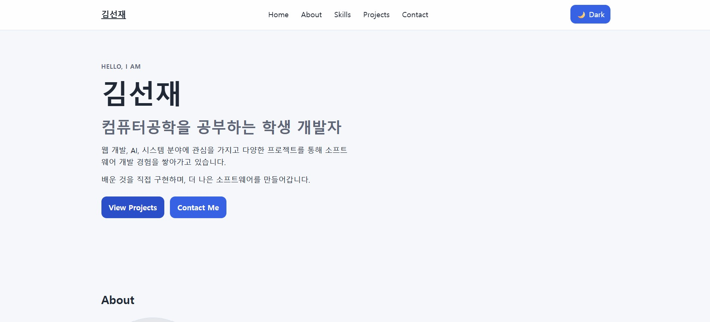
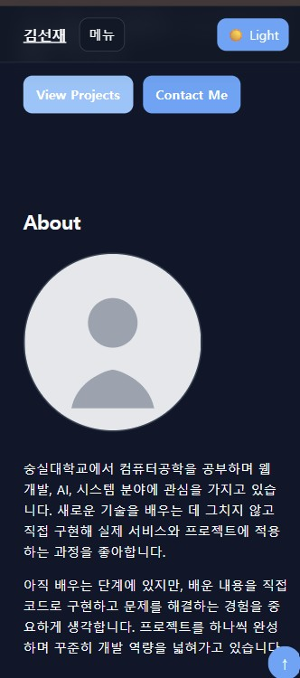
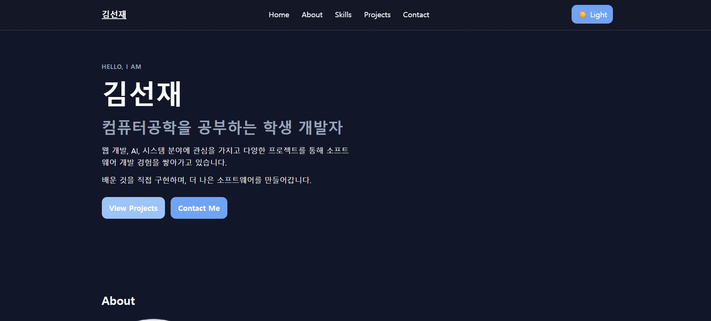

# week1-intro-portfolio

## 1. Project Title

week1-intro-portfolio

## 2. 프로젝트 소개

이 프로젝트는 `순수 HTML/CSS/JavaScript`로 만든 반응형 개인 포트폴리오입니다.  
React/Vue 같은 프레임워크 없이 **시맨틱 마크업**, **DOM 선택/이벤트**, **상태 관리 패턴**, **비동기 API 연동**을 학습하기 위한 구성입니다.  
초기 과제 목표인 웹 기초/프론트엔드 학습 80시간 흐름에 맞춰 핵심 개념 위주로 구현했습니다.

## 3. 주요 기능

구현된 기능만 정리했습니다.

- Responsive Web
- Semantic HTML
- Hamburger Menu
- Smooth Scroll
- Scroll Top
- Header Scroll Effect
- Dark Mode
- localStorage
- IntersectionObserver
- Contact Form Validation
- GitHub REST API
- Loading State
- Success State
- Error State
- Empty State
- Retry
- GitHub Project Language Filter

## 4. 기술 스택

- HTML5
- CSS3
- JavaScript ES6+
- GitHub REST API
- GitHub Pages

React, Vue, Angular, jQuery 등은 사용하지 않았습니다.

## 5. 프로젝트 구조

```
codyssey-week1-intro-portfolio/
├─ .gitignore
├─ MISSION_NOTES.txt
├─ README.md
├─ index.html
├─ css/
│  └─ style.css
├─ images/
│  └─ profile-placeholder.svg
└─ js/
   ├─ main.js
   ├─ theme.js
   ├─ github.js
   └─ form.js
```

## 6. Semantic HTML 설계

- `header`: 사이트 전체 상단 네비게이션과 테마/메뉴 조작권을 담는 영역.
- `nav`: 홈/소개/기술/프로젝트/문의 섹션으로 이동할 수 있는 내비게이션 링크 그룹을 정의.
- `main`: 페이지 핵심 콘텐츠를 감싸는 주 영역.
- `section`: 홈/소개/기술/프로젝트/문의를 논리적으로 나누어 구획화.
- `article`: 소개 본문, 프로젝트 카드 내부 블록 같은 독립적 콘텐츠 단위를 표현.
- `footer`: 저작권, 소셜 링크 등 페이지 하단 메타 정보를 담는 영역.

## 7. Flexbox vs Grid

- Navigation: 한 방향(좌우) 정렬이 중심이므로 `Flexbox` 사용.
- Projects: 행/열 기반 카드 배치와 반응형 컬럼 구성이 필요하므로 `CSS Grid` 사용.
  - `auto-fit + minmax`로 화면 폭에 따라 카드 수를 자동 조정.

## 8. 상태 관리 패턴

### Theme

Theme Toggle Click  
→ `themeState` 변경  
→ `localStorage` 저장  
→ `renderTheme()`  
→ `data-theme` 변경

### Projects

`fetchProjects()`  
→ `loading`  
→ GitHub API 요청  
→ `success / empty / error`  
→ 언어 버튼 생성

`언어 필터 버튼 click`  
→ `selectedLanguage` 변경  
→ `repositories.filter()`  
→ `renderProjects()`

### Form

`input`  
→ `formState.values`  
→ validation  
→ `formState.errors`  
→ render (`renderErrors()`)

## 9. JavaScript 학습 요소

구현에서 사용된 핵심 문법/기법:

- `querySelector`
- `querySelectorAll`
- `addEventListener`
- `classList`
- `textContent`
- `innerHTML`
- arrow function
- destructuring
- template literal
- `map`
- `forEach`
- `fetch`
- `async/await`
- `try/catch`

## 10. Interaction 기준값

- Header background 변경: `60px`
- Scroll Top button 표시: `300px`
- IntersectionObserver threshold: `0.2`
- Breakpoints: `768px`, `1024px`

## 11. GitHub API

요청 URL:
`https://api.github.com/users/SSUNOWL/repos`

적용 내용:

- `fetch` + `async/await`로 데이터 요청 처리
- `try/catch`로 성공/실패 흐름 분리
- 상태 분기:
  - loading
  - success
  - empty
  - error
- 실패 시 `Retry` 버튼으로 재시도 가능
- 인증 토큰은 클라이언트-side에 저장하지 않음
- 미인증 요청의 GitHub rate limit 대응:
  - `403`/`429`에서 메시지 안내

## 12. Form Validation

- name required
- email required
- email format (`/^[^\s@]+@[^\s@]+\.[^\s@]+$/`)
- message required
- input 실시간 검증
- submit `preventDefault`
- field error UI
- success UI

현재 제출은 **client-side validation demo**이며 실제 이메일 전송 기능은 포함하지 않습니다.
(Formspree, EmailJS, 서버 전송 로직 없음)

## 13. 실행 방법

1. repository를 열기 (클론이 필요할 경우 로컬에 복사)
2. VS Code로 프로젝트 폴더 열기
3. `index.html`을 열고
4. `Open with Live Server` 실행

빌드 과정은 없습니다.

## 14. GitHub Pages 배포 방법

1. GitHub Repository
2. Settings
3. Pages
4. Build and deployment
5. Source: Deploy from a branch
6. Branch: `main`
7. Folder: `/(root)`
8. Save

이 프로젝트는 정적 웹사이트이므로 별도 build action은 필요 없습니다.

## 15. Deployment URL

현재 환경의 Git origin은 아래와 같아, 실제 배포 URL은 아래와 같이 확인됩니다.

`https://SSUNOWL.github.io/codyssey-week1-intro-portfolio/`

## 16. Screenshots
### Desktop



### Mobile



### Dark Mode




## 17. 배운 점

- Semantic HTML 구조를 통해 접근성과 유지보수성을 높이는 방법
- Flexbox와 Grid의 역할 분리를 통해 네비게이션/카드 레이아웃 구성
- DOM selection과 이벤트 위임 흐름 정리
- State → Render 패턴으로 UI 갱신 분리
- Async API 처리(요청 상태, 예외 처리, 재시도) 경험

## 완료 상태

- 과제 요구사항, 필수 기능, 보너스 기능, README 문서가 완료되었습니다.
- README의 배포 URL 및 스크린샷 링크 정합성을 맞췄습니다.
