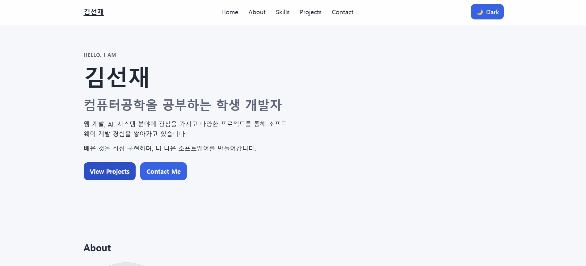
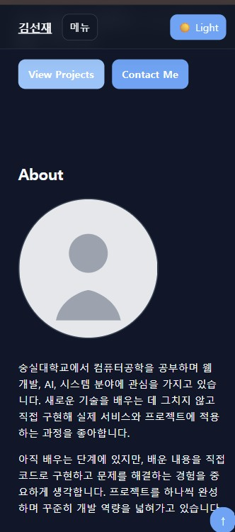
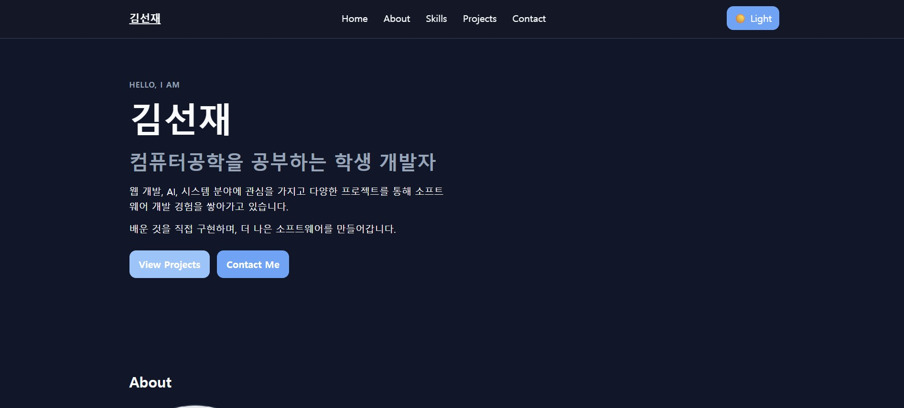

# week1-intro-portfolio

## 1. Project Title

week1-intro-portfolio

## 2. 프로젝트 소개

이 프로젝트는 `순수 HTML/CSS/JavaScript`로 만든 반응형 개인 포트폴리오입니다.  
React/Vue 같은 프레임워크 없이 **시맨틱 마크업**, **DOM 선택/이벤트**, **상태 관리 패턴**, **비동기 API 연동**을 학습하기 위한 구성입니다.  
초기 과제 목표인 웹 기초/프론트엔드 학습 80시간 흐름에 맞춰 핵심 개념 위주로 구현했습니다.

## 3. 주요 기능

구현된 기능만 정리했습니다.

- Responsive Web
- Semantic HTML
- Hamburger Menu
- Smooth Scroll
- Scroll Top
- Header Scroll Effect
- Dark Mode
- localStorage
- IntersectionObserver
- Contact Form Validation
- GitHub REST API
- Loading State
- Success State
- Error State
- Empty State
- Retry
- GitHub Project Language Filter

## 4. 기술 스택

- HTML5
- CSS3
- JavaScript ES6+
- GitHub REST API
- GitHub Pages

React, Vue, Angular, jQuery 등은 사용하지 않았습니다.

## 5. 프로젝트 구조

```
codyssey-week1-intro-portfolio/
├─ .gitignore
├─ MISSION_NOTES.txt
├─ README.md
├─ index.html
├─ css/
│  └─ style.css
├─ images/
│  └─ profile-placeholder.svg
└─ js/
   ├─ main.js
   ├─ theme.js
   ├─ github.js
   └─ form.js
```

각 스크립트는 UI, 테마, 프로젝트 API, 폼을 따로 담당합니다. 현재 규모에서는 학습 흐름이 드러나는 단순한 분리가 적절합니다. 기능이 커지면 관련 함수만 별도 모듈로 추출할 수 있습니다.

## 6. Semantic HTML 설계

- `header`: 사이트 전체 상단 네비게이션과 테마/메뉴 조작권을 담는 영역.
- `nav`: 홈/소개/기술/프로젝트/문의 섹션으로 이동할 수 있는 내비게이션 링크 그룹을 정의.
- 현재 보이는 섹션의 내비게이션 링크에 `aria-current="location"`을 붙여 화면 읽기 도구에 현재 위치를 전달합니다.
- `main`: 페이지 핵심 콘텐츠를 감싸는 주 영역.
- `section`: 홈/소개/기술/프로젝트/문의를 논리적으로 나누어 구획화.
- `article`: 소개 본문, 프로젝트 카드 내부 블록 같은 독립적 콘텐츠 단위를 표현.
- `footer`: 저작권, 소셜 링크 등 페이지 하단 메타 정보를 담는 영역.

## 7. Flexbox vs Grid

- Navigation: 한 방향(좌우) 정렬이 중심이므로 `Flexbox` 사용.
- Projects: 행/열 기반 카드 배치와 반응형 컬럼 구성이 필요하므로 `CSS Grid` 사용.
  - `auto-fit + minmax`로 화면 폭에 따라 카드 수를 자동 조정.

## 8. 상태 관리 패턴

### Theme

Theme Toggle Click  
→ `themeState` 변경  
→ `localStorage` 저장  
→ `renderTheme()`  
→ `data-theme` 변경

테마 전환은 각 요소의 색을 JavaScript로 직접 바꾸지 않습니다. CSS 색상 변수만 루트 테마에 따라 바뀌고, 배경과 글자색은 짧게 전환됩니다. `prefers-reduced-motion`에서는 전환 시간을 사실상 없앱니다.

### Projects

`fetchProjects()`  
→ `loading`  
→ GitHub API 요청  
→ `success / empty / error`  
→ 언어 버튼 생성

`언어 필터 버튼 click`  
→ `selectedLanguage` 변경  
→ `repositories.filter()`  
→ `renderProjects()`

### Form

`input`  
→ `formState.values`  
→ validation  
→ `formState.errors`  
→ render (`renderErrors()`)

이벤트는 각 기능 파일에서 직접 등록합니다. 현재 버튼과 입력 수가 적어 공통 이벤트 바인더를 도입하지 않았으며, 개발 중에는 DevTools에서 `themeState`, `projectState`, `formState`를 확인할 수 있습니다. 운영 화면에 상태 로그를 계속 출력하지 않습니다.

## 9. JavaScript 학습 요소

구현에서 사용된 핵심 문법/기법:

- `querySelector`
- `querySelectorAll`
- `addEventListener`
- `classList`
- `textContent`
- `innerHTML`
- arrow function
- destructuring
- template literal
- `map`
- `forEach`
- `fetch`
- `async/await`
- `try/catch`

## 10. Interaction 기준값

- Header background 변경: `60px`
- Scroll Top button 표시: `300px`
- IntersectionObserver threshold: `0.2`
- Breakpoints: `768px`, `1024px`

반응형 수동 점검표: `375px`에서는 메뉴 버튼과 한 열 카드·폼을, `768px`에서는 가로 메뉴와 About 2열을, `1024px`와 `1440px`에서는 여백·카드 열 수를 확인합니다. 모든 폭에서 가로 스크롤, 프로필 이미지 넘침, CTA 겹침이 없는지도 확인합니다.

## 11. GitHub API

요청 URL:
`https://api.github.com/users/SSUNOWL/repos`

적용 내용:

- `fetch` + `async/await`로 데이터 요청 처리
- `try/catch`로 성공/실패 흐름 분리
- 상태 분기:
  - loading
  - success
  - empty
  - error
- 실패 시 `Retry` 버튼으로 재시도 가능
- 인증 토큰은 클라이언트-side에 저장하지 않음
- 미인증 요청의 GitHub rate limit 대응:
  - `403`/`429`에서 메시지 안내

API는 최신 저장소 최대 12개를 요청합니다. 요청 한도에 걸리면 즉시 반복 호출하지 말고 잠시 기다린 후 `다시 시도`를 누릅니다. 자동 백오프와 페이지네이션은 현재 작은 카드 목록에는 넣지 않았습니다. 더 많은 저장소가 필요해지면 페이지네이션과 요청 횟수 제한을 함께 설계해야 합니다.

## 12. Form Validation

- name required
- email required
- email format (`/^[^\s@]+@[^\s@]+\.[^\s@]+$/`)
- message required
- input 실시간 검증
- submit `preventDefault`
- field error UI
- success UI

현재 제출은 **client-side validation demo**이며 실제 이메일 전송 기능은 포함하지 않습니다.
(Formspree, EmailJS, 서버 전송 로직 없음)

실제 전송을 추가한다면 입력 검증 이후 `loading` 상태로 중복 제출을 막고, 서버 응답에 따라 성공 또는 오류를 표시해야 합니다. 서버에서도 입력을 다시 검증해야 합니다.

## 13. 실행 방법

1. repository를 열기 (클론이 필요할 경우 로컬에 복사)
2. VS Code로 프로젝트 폴더 열기
3. `index.html`을 열고
4. `Open with Live Server` 실행

빌드 과정은 없습니다.

## 14. GitHub Pages 배포 방법

1. GitHub Repository
2. Settings
3. Pages
4. Build and deployment
5. Source: Deploy from a branch
6. Branch: `main`
7. Folder: `/(root)`
8. Save

이 프로젝트는 정적 웹사이트이므로 별도 build action은 필요 없습니다.

## 15. Deployment URL

현재 환경의 Git origin은 아래와 같아, 실제 배포 URL은 아래와 같이 확인됩니다.

`https://SSUNOWL.github.io/codyssey-week1-intro-portfolio/`

## 16. Screenshots
### Desktop



### Mobile



### Dark Mode




## 17. 배운 점

- Semantic HTML 구조를 통해 접근성과 유지보수성을 높이는 방법
- Flexbox와 Grid의 역할 분리를 통해 네비게이션/카드 레이아웃 구성
- DOM selection과 이벤트 위임 흐름 정리
- State → Render 패턴으로 UI 갱신 분리
- Async API 처리(요청 상태, 예외 처리, 재시도) 경험

## 접근성 수동 점검

- 키보드에서 메뉴 버튼은 기본 `Enter`/`Space`로 동작하며, 열린 메뉴는 `Escape`로 닫고 버튼에 포커스를 돌려줍니다.
- `Tab`으로 로고 → 메뉴/내비게이션 → 테마 → 본문 링크 → 폼 순서의 포커스 이동과 `:focus-visible` 표시를 확인합니다. 화면 폭에 따라 숨겨진 메뉴 링크가 포커스 순서에 남지 않는지도 확인합니다.
- 라이트/다크 모드 모두에서 본문, 버튼, 폼 오류, 프로젝트 상태의 대비를 브라우저 접근성 도구로 확인합니다. 일반 텍스트는 4.5:1, 큰 텍스트는 3:1을 목표로 합니다. 대비비의 실제 측정값은 아직 기록하지 않았습니다.

## 완료 상태

- 과제 요구사항, 필수 기능, 보너스 기능, README 문서가 완료되었습니다.
- README의 배포 URL 및 스크린샷 링크 정합성을 맞췄습니다.

## AI 사전평가 15개 항목 설명 노트

2026-09-21 사전평가는 **15/15 PASS**였습니다. 아래는 당시 지적된 부족한 점을 빠짐없이 적고, 현재 코드에서 어떻게 설명할지 정리한 학습 노트입니다. `반영`은 코드 또는 문서에 적용한 내용이고, `확장 시 고려`는 이번 과제에 구현하지 않은 기능입니다. 사전평가 이후 변경한 부분의 브라우저 동작과 색 대비비는 별도 실측 결과로 주장하지 않습니다.

1. **반응형 레이아웃 — 반영.** 지적: README에 화면 크기별 설명은 있지만 코드 안의 검증 절차가 부족했습니다. `css/style.css`의 768px·1024px 미디어쿼리 옆에 레이아웃 변경 이유를 적었고, README의 **Interaction 기준값**에 375/768/1024/1440px 수동 점검표를 넣었습니다. 설명할 말: "모바일을 기본으로 작성하고, 768px부터 가로 메뉴와 About 2열, 1024px부터 넓은 여백과 카드 열을 적용합니다. 각 폭에서 가로 스크롤과 요소 넘침을 직접 확인해야 합니다."

2. **다크모드 전환 설명 — 반영.** 지적: 저장 기능은 있지만 시각적 전환과 애니메이션 제어에 대한 설명이 부족했습니다. `js/theme.js`는 루트의 `data-theme`를 바꾸고, `css/style.css`는 색상 변수를 교체합니다. 배경·글자색 전환은 CSS가 담당하며 `prefers-reduced-motion`에서는 전환 시간을 줄입니다. 설명할 말: "버튼 클릭 → `themeState` 변경 → `localStorage` 저장 → `renderTheme()` 순서이며, JavaScript가 요소마다 색을 직접 칠하지 않습니다."

3. **햄버거 키보드 접근성 — 반영.** 지적: 키보드와 포커스 경로 설명, 특히 `Escape` 동작이 부족했습니다. 메뉴는 실제 `<button>`이므로 `Enter`/`Space`가 기본 동작하고, `js/main.js`에서 열린 메뉴에 `Escape`를 누르면 닫은 뒤 메뉴 버튼에 포커스를 돌립니다. 설명할 말: "화면의 열림 상태와 `aria-expanded`/`aria-label`을 함께 갱신해 키보드와 화면 읽기 도구 사용자에게 같은 상태를 전달합니다."

4. **GitHub API 요청 한도 안내 — 부분 반영.** 지적: `403`/`429` 안내는 있지만 고급 재시도 전략이 없었습니다. `js/github.js`는 해당 응답에서 요청 한도 가능성을 알리고 수동 `다시 시도` 버튼을 제공합니다. 설명할 말: "미인증 API 한도에 걸렸을 때 즉시 반복 요청하면 상황이 나아지지 않으므로, 사용자가 기다렸다가 다시 시도하도록 안내합니다." 자동 재시도와 대기 시간 계산은 **확장 시 고려**합니다.

5. **폼 서버 응답 상태 — 의도적으로 미구현.** 지적: 실제 전송 뒤의 로딩·성공·실패 흐름이 없습니다. 이 과제의 폼은 `js/form.js`의 클라이언트 입력 검증 데모이며 이메일을 보내지 않습니다. 설명할 말: "현재 성공 문구는 입력 형식이 맞다는 뜻입니다. 실제 전송을 붙인다면 중복 제출 방지용 로딩 상태, 서버 응답 오류, 서버 측 재검증이 필요합니다."

6. **파일 모듈화 — 현재 규모에 맞게 분리.** 지적: 파일은 분리됐지만 ES 모듈 수준의 추가 분리는 없습니다. `main.js`/`theme.js`/`github.js`/`form.js`가 각자 한 기능을 담당합니다. 설명할 말: "지금은 일반 스크립트와 고유한 전역 이름으로 DOM·이벤트 학습 흐름을 보이게 했습니다. 파일이 커지고 기능 간 공유가 필요해지면 ES 모듈 도입을 검토하겠습니다."

7. **현재 내비게이션 위치 — 반영.** 지적: 메뉴에 현재 위치를 알리는 ARIA 표시가 없었습니다. `js/main.js`가 스크롤 위치에 해당하는 링크에 `aria-current="location"`을 붙이고 다른 링크에서는 제거합니다. 설명할 말: "시각적 밑줄과 화면 읽기 도구의 현재 위치 안내를 같은 속성에 연결했습니다."

8. **CSS 변수 설명 — 반영.** 지적: 디자인 토큰의 용도가 주석에 드러나지 않았습니다. `css/style.css`에서 색상, 간격·모서리, 전환·페이지 폭 변수 그룹에 용도 주석을 넣었습니다. 설명할 말: "컴포넌트는 토큰을 참조하므로 테마 색을 한곳에서 바꾸고 같은 간격을 재사용할 수 있습니다."

9. **이벤트 바인딩 재사용 — 확장 시 고려.** 지적: 파일 간 바인딩 방식이 반복될 수 있어 공통 유틸 제안이 있었습니다. 현재 이벤트는 각 기능 파일에서 `addEventListener`로 직접 등록합니다. 설명할 말: "이벤트 종류와 요소 수가 적어 공통 바인더보다 각 기능의 이벤트 시작점이 보이는 편이 학습에 유리합니다. 중복이 실제로 늘어나면 그때 추출하겠습니다."

10. **상태 → 렌더 주석 — 반영.** 지적: README에는 흐름이 있지만 코드 옆 설명이 적었습니다. 테마 설정, 프로젝트 상태 렌더링, 폼 입력 동기화에 짧은 이유 주석을 남겼습니다. 설명할 말: "이벤트 안에서 화면을 임의로 바꾸기보다 상태를 먼저 바꾸고 렌더 함수가 DOM을 갱신하는 패턴입니다."

11. **비동기 백오프 — 확장 시 고려.** 지적: `async/await`와 `try/catch`는 있지만 네트워크 자동 재시도·백오프가 없습니다. 설명할 말: "현재는 오류 상태와 수동 재시도로 요청 횟수를 통제합니다. 자동 재시도가 필요하면 횟수 상한과 점진적 대기, 가능할 경우 서버의 재시도 안내를 고려해야 합니다." 이 로직이 현재 구현됐다고 주장하지 않습니다.

12. **대량 저장소 처리 — 확장 시 고려.** 지적: 필터·매핑은 있지만 가상화·페이지네이션이 없습니다. GitHub 요청은 최신 저장소 **최대 12개**를 가져와 카드로 표시합니다. 설명할 말: "작은 목록에서는 `filter`와 `map`만으로 충분합니다. 전체 저장소를 보여줄 요구가 생기면 API 페이지네이션을 먼저 추가하고, 화면에 매우 많은 카드가 쌓일 때 가상화를 검토하겠습니다."

13. **Flexbox와 Grid 선택 이유 — 반영.** 지적: README에는 이유가 있지만 CSS 옆 주석이 부족했습니다. `css/style.css`의 내비게이션 Flexbox와 프로젝트 카드 Grid에 선택 이유를 적었습니다. 설명할 말: "내비게이션은 한 방향으로 정렬하므로 Flexbox, 프로젝트는 행·열 카드와 `auto-fit`/`minmax` 반응형 열 구성이 필요하므로 Grid를 사용합니다."

14. **상태 변경 로그 — 확장 시 고려.** 지적: 개발용 상태 추적 로그가 없습니다. 현재 `themeState`, `projectState`, `formState`는 기능별로 분리되어 있으며 필요하면 브라우저 DevTools에서 확인할 수 있습니다. 설명할 말: "학습용 화면에 상시 콘솔 로그를 남기지 않았습니다. 복잡한 버그를 추적해야 할 때만 개발용 로깅을 추가하겠습니다."

15. **색 대비와 포커스 순서 — 일부 반영, 수동 측정 필요.** 지적: 접근성 속성은 있지만 대비비 수치와 키보드 순서 기록이 부족했습니다. 다크모드의 버튼 글자색·오류색을 보정하고 `:focus-visible` 및 README의 포커스 점검 절차를 마련했습니다. 설명할 말: "일반 텍스트 4.5:1, 큰 텍스트 3:1을 목표로 라이트/다크 화면을 측정하고, `Tab` 순서와 숨겨진 메뉴 링크의 포커스 진입 여부를 확인해야 합니다." 실제 대비비 측정값은 아직 기록하지 않았습니다.

발표할 때는 **"이미 통과한 필수 기능"**, **"평가 후 반영한 접근성·설명 개선"**, **"과제 범위 밖이라 구현하지 않은 확장 기능"**을 구분해 말하면 됩니다. 특히 서버 전송, 자동 백오프, 페이지네이션, 상시 상태 로깅은 현재 기능인 것처럼 설명하지 않습니다.
